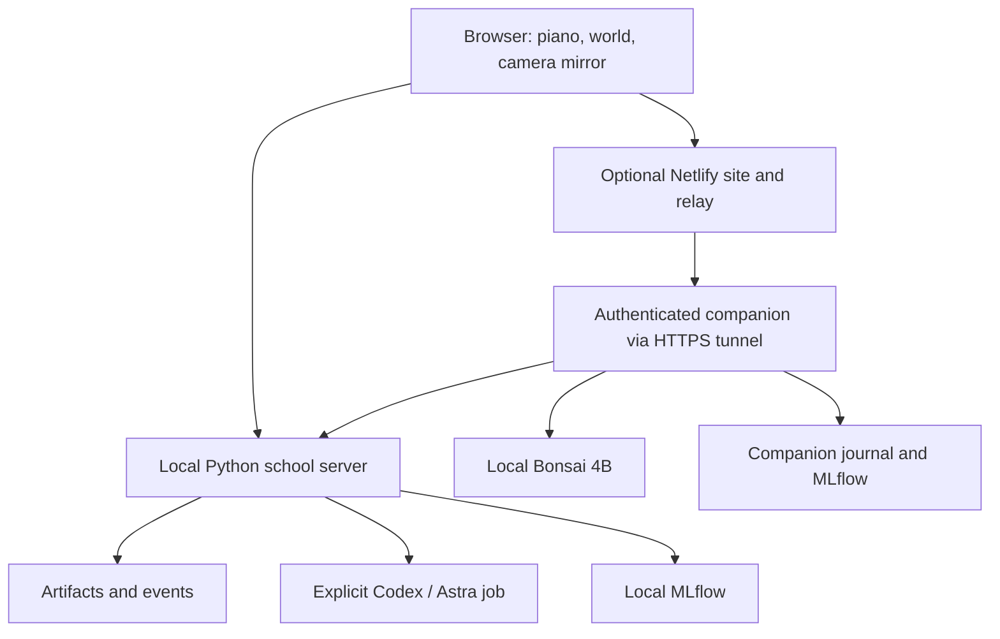

# Architecture

The browser runs the scenes. A loopback Python server stores artifacts and runs explicit Astra jobs. An optional authenticated companion supplies local-model cues and connects a hosted frontend to the presenter machine.

## Follow an interaction

The learner saves an artifact with event references. An explicit Astra request freezes context, starts a bounded process, and validates structured output. Supported changes have preview, apply, and undo controls. Related artifact versions and traces preserve provenance; stale responses must not overwrite newer state.

The camera loop runs in the browser. Local cue requests send compact observations, not camera frames. The foundation action submits a declared learner report. Authored cues, model selections, simulation values, and camera estimates remain distinct evidence categories.

## Find the implementation

| Component | Source | Responsibility |
| --- | --- | --- |
| Scenes | `public/` | Interaction, audio, camera, rendering, proposal controls |
| School | `server.py` | Loopback HTTP, persistence, jobs, review routes |
| Structured output | `schema.json` | Model result validation |
| Companion | `companion.py` | Authentication, bounded cues, retries, inference |
| Curriculum | `public/data/boxing-foundations.json` | Cues, prerequisites, sources, assessments |
| Hosting | `netlify.toml`, `deployment/netlify-relay.mjs` | Static deployment and restricted forwarding |
| Build | `scripts/build-netlify.mjs` | Public bundle and deployment SHA |

## Use API boundaries

`GET /api/state` reads state. `POST /api/artifacts` saves an artifact. `POST /api/project` starts a proposal; `GET /api/jobs/:id` reads status and `POST /api/jobs/:id/cancel` requests cancellation. `POST /api/coach` forwards a bounded cue request. Consult `server.py` and its tests for exact validation. The original contract is a historical snapshot, not the complete current API specification.

The hosted relay exposes only its allowlisted subset. References, raw job files, diagnostics, and review administration remain local. Missing configuration returns an explicit error. Shared demo access is not per-student identity or tenant isolation.

## Configure and inspect

The school accepts `--port`, `--data-dir`, and `--tracking-uri`. `ASTRAL_CODEX_BIN` selects the Codex executable; `MLFLOW_TRACKING_URI` supplies fallback trace configuration. Read the [deployment guide](netlify-local-inference.md) for companion settings.

Artifacts, credentials, model weights, private recordings, and trace stores do not belong in deployment bundles. The build excludes `public/audio/local`. Preserve revision, actor, fixture status, and trace IDs when reporting results. This implementation does not establish an NVIDIA OpenShell runtime integration.
