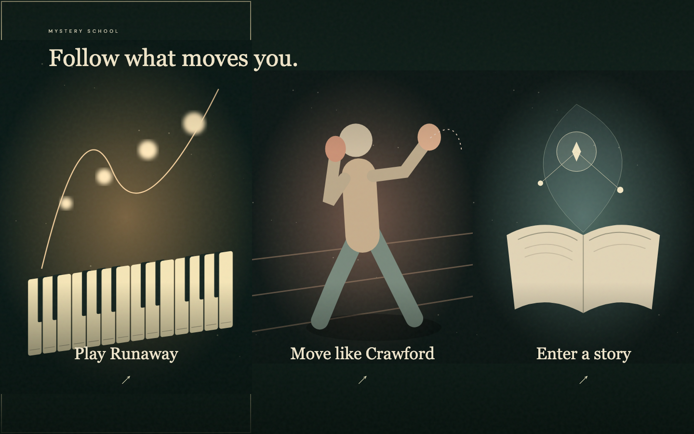
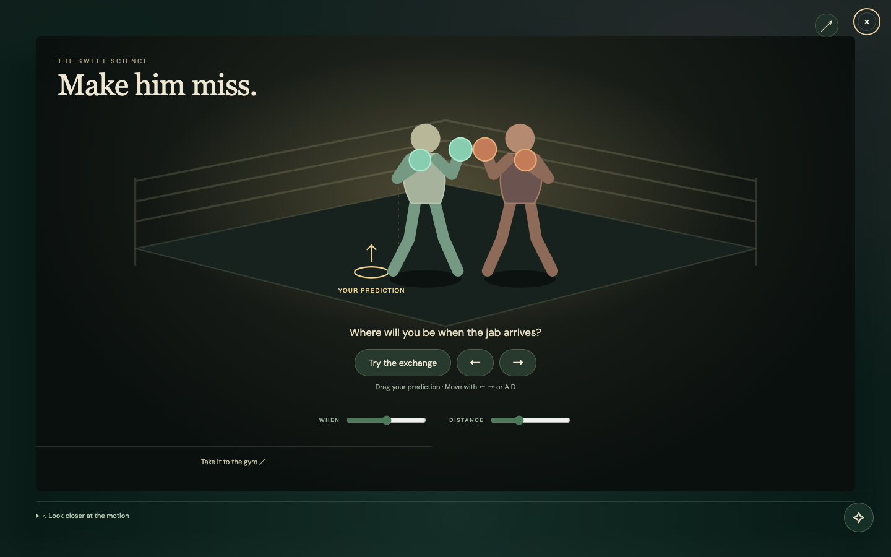
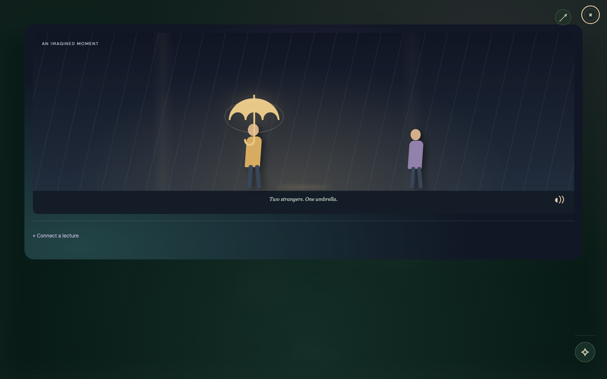

# Experience, make, return to life

Jai's demo order is **Runaway opening → boxing deep dive → classics through
stories**. The purpose is to extend the audience's idea of taste: trying many
things and making something are prerequisites for developing judgment, and the
learning should return to life outside the computer.

This refactor replaces the persistent worksheet with three playable scenes and
a cinematic world selection. The star opens optional keeping, sharing, questions
and provenance. Existing artifacts and model confirmation remain available.

## Demonstrate the actual loop

1. Open `/` in a fresh tab and choose Runaway. Hear it plays a two-strike E6
   exercise from the published arrangement, separately from the learner's take.
   Source links remain optional. Hold piano keys, record a short attempt, stop and
   replay. The light follows emitted note events; the small timeline represents
   recorded notes. **Keep this. Into the ring** saves the performance first.
2. Predict a position, try the exchange, then inspect the jab frame. A stationary
   attempt remains within the modeled reach. Retreat and return, compare the
   retained trail, change the cue/distance and retry. Scrubbing shows actual
   displacement divided by time in simulation units/s. Keep the attempt and enter
   the story. The gym question connects the experiment to coached practice.
3. Offer an umbrella in an explicitly authored rainy-street scene. Discover the
   source book when curious; express an interpretation, encounter a different
   situation, keep or reconsider it, and save the exact account. The authored
   animation and an Astra-proposed thought experiment remain distinct.

Piano, boxing and ideas retain their own artifacts, declared actor, event IDs
and MLflow trace IDs. Automatic walkthroughs use `actor=agent_review`. A successful
interaction is not evidence of musical accuracy, boxing proficiency or learning.

## Grounding and current limits

- The [published arrangement](https://www.musicnotes.com/sheetmusic/kanye-west/runaway/MN0103069)
  supports a bounded E6 two-strike exercise at 80 BPM, with 1.5 seconds between
  strikes. The app compares the first two actual note pitches and onset spacing;
  it does not grade full-song accuracy. See maincar's inspected-source record in
  `docs/reviews/runaway-source-20260910.md`. The original recording remains an
  optional external reference. Chromium reported its YouTube embed unavailable,
  so the demo opening uses local synthesis rather than that unreliable embed.
- [England Boxing's handbook](https://www.englandboxing.org/wp-content/uploads/2022/03/EB_Boxing-Coaching-Handbook-Part-1_v8-002.pdf),
  printed pages 66–68 and 94–95, informs the stance/guard/footwork and coached
  non-contact practice framing. The one-dimensional game does not reproduce
  Terence Crawford's full technique or measure a person's body. Its geometry is
  a simplified model, with no impact-force or physical reaction-time claims.
- Boxing round parameters are separate from the older meter-based physics lab.
  Maincar commit `b3f4c6f` adds bounded typed proposals for
  `boxing_round.params` while preserving attempts. Earlier agent walkthroughs
  below predate that integration and do not prove a live model-controlled round.
- The classics activity preserves Jai's supplied learning circle. Jiang-specific
  materials were not found in the available project context; this implementation
  must not be attributed to Jiang. The rainy-street scene is authored for the
  demo, not a scene quoted from a canonical book.
- External video availability and audible quality require direct checks on the
  presentation machine. Stored/public model replay is distinct from live inference.

Run the README setup commands and open the exact committed build. The cinematic
opening is shown once per tab; the arrow in a scene reopens world selection.
The old desktop-stage layout is superseded by universe and scene styles.

## Executed agent walkthrough

At 1440×900, Chromium completed piano record → keep/enter ring → timed exchange
→ keep/enter story → umbrella choice → own interpretation → save/reopen with
no page exceptions. The restored text matched exactly. Local agent-review
records (not public replay fixtures) link the observations to real event traces:

| Path | Artifact | Trace | Evidence |
| --- | --- | --- | --- |
| Music | `eb32c9d6-4030-47ae-b227-ad29d0de3950` | `tr-eceb8926b758e19402cee3a67d695915` | Two captured note events, six linked action records and artist-video reference |
| Boxing | `e0261d31-f5c8-477d-8c54-36855d5ea950` | `tr-8885b775c5f36c4593402e34accbcdbb` | One timed attempt, four linked records and coaching source |
| Ideas | `8270a5b0-455c-4e03-b2c1-b49abf68e86b` | `tr-869f019793c0cba1d74767c9824a9fa1` | Saved shelter choice, exact account and five linked records |

The stationary boxing attempt was correctly inside reach. Separate browser
probes established retreat-only does not count as returning, while retreat and
return does. The replay scrubber read −4.5 simulation units / 0.30 seconds =
−15.0 simulation units/s from the recorded trace. These are software/model
observations, not participant results.

After reconciliation with maincar `01c241e`, the opening uses the shared
`demonstrate` / `analyzeOpening` implementation. Chromium teacher playback left
the learner event array empty. The learner recorded E6 twice; feedback reported
the actual 2.17-second interval and the 1.50-second target. No page exceptions
occurred. All 146 JavaScript tests passed. The unavailable embedded artist
video has been replaced by an optional external artist link. Speaker fidelity and original-recording alignment
remain unverified; this is an arrangement exercise, not a recording transcription.

